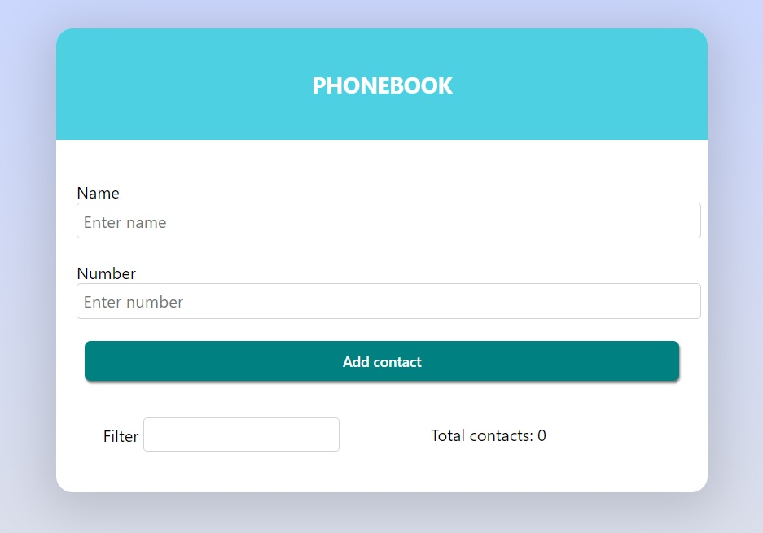
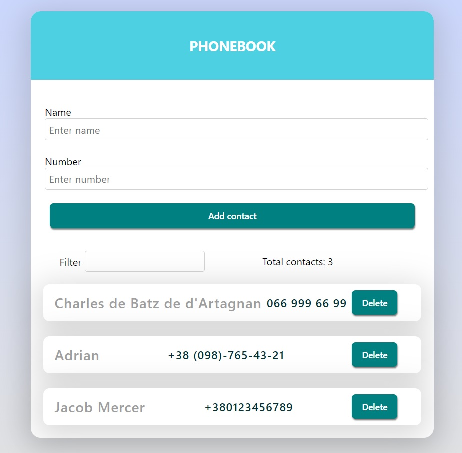
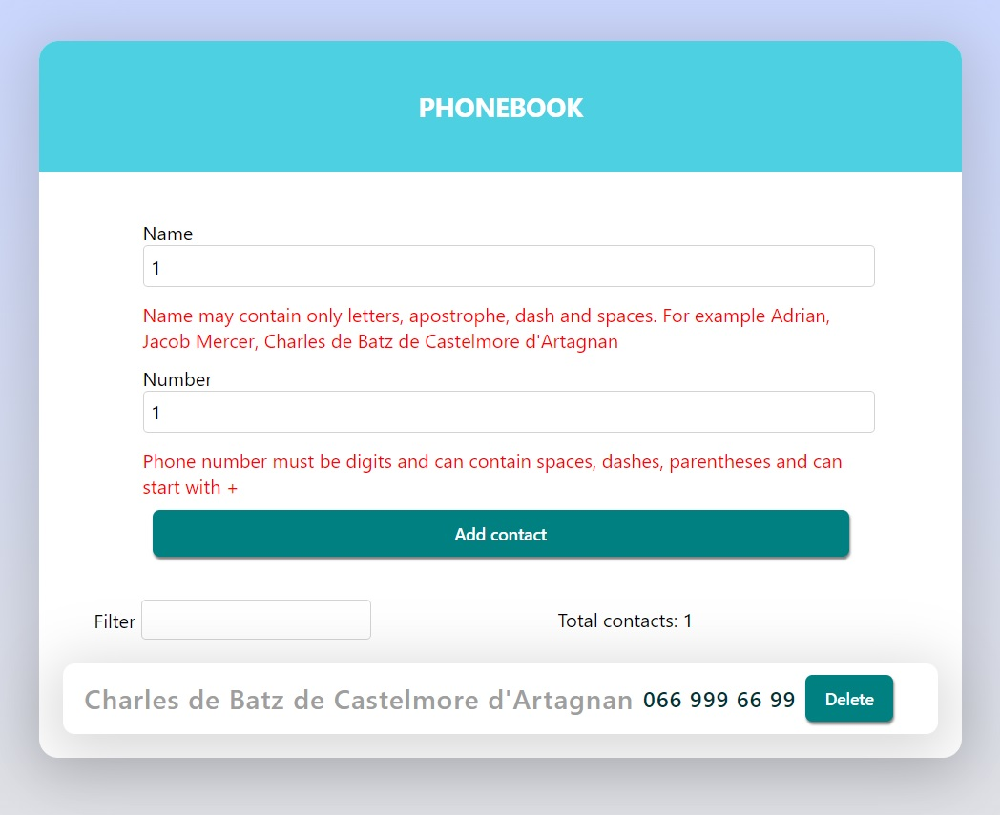

# Phonebook App

The Phonebook App is a simple web application built with React that allows users
to store and manage their contacts. Users can add new contacts with a name and
phone number, view their contacts, and filter contacts based on a search query.

## Features

- Add a new contact: Enter a name and phone number to add a new contact to the
  phonebook.
- View contacts: See a list of all contacts in the phonebook.
- Filter contacts: Search for specific contacts by name using the filter
  feature.
- Delete contacts: Remove a contact from the phonebook.

## Screenshots

 _Phonebook App 1_

 _With contact list_

 _Catching Errors_

## Technologies Used

- React: JavaScript library for building user interfaces.
- Formik: Form library for React to handle form state and validation.
- Yup: JavaScript schema builder for form validation.
- @emotion/react: CSS-in-JS library for styling components.
- shortid: Library for generating unique IDs for contacts.
- prop-types: Runtime type checking for React props.
- modern-normalize: Modern CSS reset styles.
- react-scripts: Development and build scripts for React applications.
- reduxjs/toolkit: For State management.

## Getting Started

To get started with the Phonebook App, follow these steps:

1. Clone the repository:
   `git clone https://github.com/your-username/phonebook-app.git`
2. Install the dependencies: `npm install`
3. Start the development server: `npm start`
4. Open the app in your browser: `http://localhost:3000`

## Deployment

The app can be deployed to various hosting platforms, such as GitHub Pages,
Netlify, or Heroku. To deploy the app, follow these general steps:

1. Build the production-ready bundle: npm run build
2. Deploy the contents of the build folder to your preferred hosting platform.
3. Configure the hosting platform to serve the index.html file as the entry
   point.

For specific instructions on deploying to a particular platform, refer to their
respective documentation.

## Folder Structure

The project structure is organized as follows:

- src: Contains the application source code.
  - components: Holds reusable components used in the app.
    - App: The main application component.
    - ContactForm: Component for adding new contacts.
    - ContactFilter: Component for filtering contacts by name.
    - ContactList: Component for displaying the list of contacts.
    - ContactStats: Component for displaying the total contact count.
    - Each component has its own folder with the component file and related
      files.
  - styles: Contains global styles and theme configuration.
  - index.js: Entry point of the application.

## Contributing

Contributions are welcome! If you find any issues or have suggestions for
improvement, please feel free to open an issue or submit a pull request.

## License

This project is licensed under the MIT License. See the [LICENSE](LICENSE) file
for details.

## Acknowledgments

This app was created as a homework assignment for the React module of a coding
at Go IT Courses. Thanks to the creators and contributors of the open-source
libraries used in this project.

## Contact

If you have any questions or suggestions, feel free to contact me at
vadborov@gmail.com.
